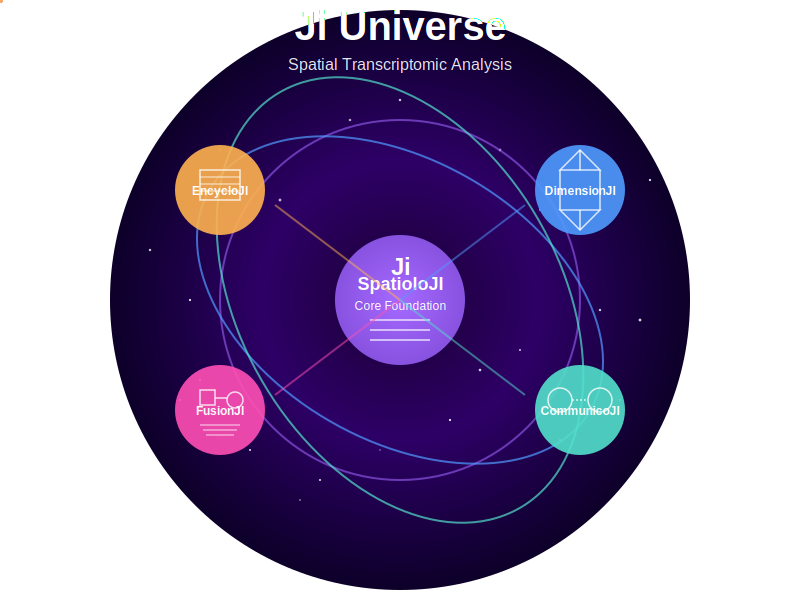

Ji Universe Ecosystem
=======================

Ji Universe is a comprehensive suite of specialized Python packages designed for cutting-edge spatial transcriptomic analysis. Our ecosystem offers powerful tools for researchers to explore, analyze, and visualize spatial gene expression data with unprecedented depth and precision.

.. toctree::
   :maxdepth: 2
   :caption: Ecosystem Overview
   
   overview
   architecture
   roadmap
   
Core Packages
---------------

.. toctree::
   :maxdepth: 1
   :caption: Core Packages
   
   SpatioloJI
   DimensionJI
   CommunicoJI
   FusionJI
   EncycloJI

SpatioloJI: Core Foundation
~~~~~~~~~~~~~~~~~~~~~~~~~

SpatioloJI serves as the foundational cornerstone of the Ji Universe, providing essential infrastructure that powers all other packages in the ecosystem. This core library implements fundamental workflows and data structures optimized for spatial transcriptomic analysis.

:doc:`Learn more about SpatioloJI → <spatioloji>`

DimensionJI: Multidimensional Analysis
~~~~~~~~~~~~~~~~~~~~~~~~~~~~~~~~~~~

DimensionJI extends spatial analysis into higher dimensions, enabling researchers to analyze complex 3D tissue architectures and temporal dynamics in spatial transcriptomic data.

:doc:`Learn more about DimensionJI → <dimensionji>`

CommunicoJI: Cell-Cell Communication
~~~~~~~~~~~~~~~~~~~~~~~~~~~~~~~~~

CommunicoJI specializes in analyzing intercellular communication patterns using spatial information, enabling researchers to uncover how cells interact within the tissue microenvironment.

:doc:`Learn more about CommunicoJI → <communicoji>`

FusionJI: Image-Transcriptome Integration
~~~~~~~~~~~~~~~~~~~~~~~~~~~~~~~~~~~~~~

FusionJI bridges the gap between imaging data and spatial transcriptomics, providing powerful tools to integrate and analyze these complementary data types.

:doc:`Learn more about FusionJI → <fusionji>`

EncycloJI: Method Repository
~~~~~~~~~~~~~~~~~~~~~~~~~

EncycloJI serves as a curated repository of established spatial transcriptomic analysis methods, providing standardized interfaces, benchmarking capabilities, and comprehensive documentation.

:doc:`Learn more about EncycloJI → <encycloji>`

Resources
------------

.. note::
   Ji Universe is under active development. Some packages may still be in development or planning stages.
   For the latest information, please visit our `GitHub repository <https://github.com/gynecoloji/Ji_Universe>`_.